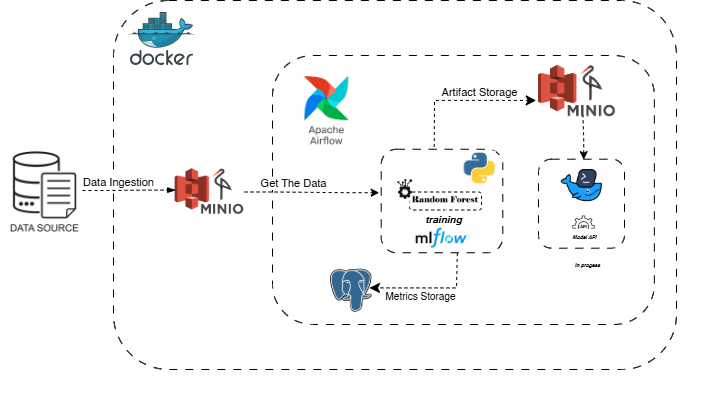

#  MLOps Pipeline with MLflow, Apache Airflow, MinIO & Docker

##  Overview

This project implements a complete **MLOps pipeline** leveraging open-source tools to streamline data ingestion, model training, tracking, and deployment...

- **Apache Airflow** for workflow orchestration  
- **MinIO** for data and artifact storage  
- **MLflow** for experiment tracking and model registry  
- **Random Forest** for machine learning  
- **PostgreSQL** for metrics storage  
- **Docker** to containerize services  
- **Model API** for serving predictions  (in pogress)

The project uses **NYC Yellow Taxi trip data** as the dataset source.

---

##  Dataset

We use the **NYC Yellow Taxi trip records** provided by [NYC.gov Open Data](https://www.nyc.gov/site/tlc/about/tlc-trip-record-data.page):
- **Ingestion**: The raw dataset is downloaded and uploaded into **MinIO** (S3-compatible object store) using an Airflow task.

---

##  Architecture Overview

The MLOps pipeline follows this flow:

1. **Data Ingestion**
   - Airflow DAG downloads the Yellow Taxi dataset.
   - Data is stored in **MinIO** (raw zone).

2. **Feature Extraction & Preprocessing**
   - A preprocessing script pulls data from MinIO, cleans, and extracts features.

3. **Model Training**
   - Features are passed to an **Random Forest** model.
   - MLflow tracks hyperparameters, metrics, and stores trained models.

4. **Artifact & Metrics Logging**
   - Trained model and metadata are stored in **MinIO** via MLflow.
   - Model metrics are logged to **PostgreSQL**.

5. **Model Deployment** -- in progress
   - Best model is deployed through a RESTful **Model API**.

---

##  Tech Stack

| Component         | Tool                     |
|-------------------|--------------------------|
| Data Storage      | MinIO                    |
| Workflow Manager  | Apache Airflow           |
| ML Tracking       | MLflow                   |
| Model Training    | RandomForest             |
| Database          | PostgreSQL               |
| API Serving       | FastAPI or Flask         |
| Containerization  | Docker                   |

---